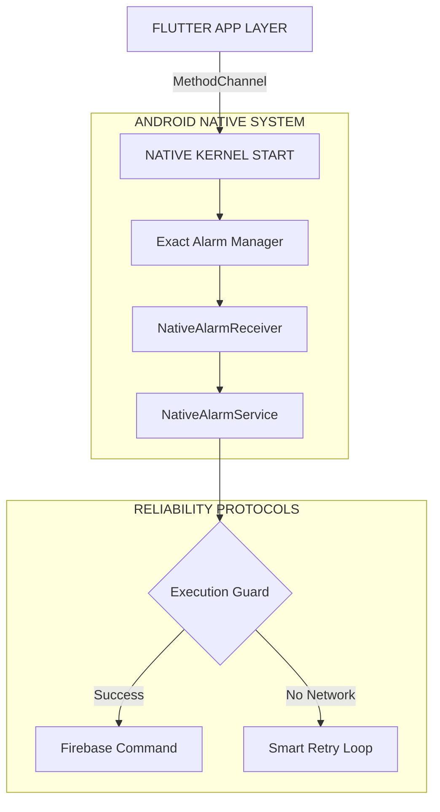

# Nebula Core v1.2.0+30 (ULTIMATE PRECISION)

**Release Date:** January 20, 2026  
**Build ID:** `NC-ANDROID-REL-30`  
**Update Size:** UI REFINEMENT & VISIBILITY OVERHAUL  
**Priority:** RECOMMENDED

---

## 🚀 WHAT'S NEW: THE VISIBILITY UPDATE

This release brings the Automation Hub to perfection with OLED-optimized visuals, enhanced visibility, and unique visual identifiers for each schedule.

### 🖤 OLED Black UI (Hardcoded)
*   **Pure Black Background**: Hardcoded `Colors.black` - no longer affected by theme changes
*   **Zero Blur**: Removed all blur effects for rock-solid 90FPS performance
*   **Premium Contrast**: High-contrast borders and text for maximum readability

### 🏷️ Device Rename Functionality
*   **Edit from Hub**: Tap the Edit icon in the Automation Hub header to rename any device
*   **Firebase Sync**: Name changes instantly sync across all devices via Firebase
*   **Persistent**: Renamed devices maintain their custom names across app restarts

### 🎨 Unique Clock Colors
*   **Visual Identity**: Each schedule now has a unique vibrant clock icon color
*   **Color Hash**: Colors are deterministically generated from schedule ID
*   **Easy Recognition**: Quickly identify schedules at a glance by their color

### ⚪ Enhanced Visibility
*   **Bright AM/PM**: Changed from grey to white for better readability
*   **High-Contrast Pills**: ON pills now use white, OFF pills use red
*   **Monochrome Border**: Create Schedule button features elegant white/grey dot-moving animation

### 🛡️ Stability Improvements
*   **Crash Fix**: Hardened `NativeAlarmService` with comprehensive error handling
*   **WakeLock Optimization**: Improved background task reliability

---

## 📚 CORE CONCEPT: SCHEDULER ENGINE

### 🕒 What is the Scheduler Engine?

The Scheduler Engine allows your smart grid to operate autonomously based on time.

*   **The Concept**: "Turn on the Porch Light at 7:00 PM every weekday."
*   **How it Works**: Unlike simple timers, this uses the Android Kernel's AlarmManager to wake up your device even from deep sleep. It respects your "Do Not Disturb" settings but ensures your lights trigger exactly when planned.
*   **Key Capability**: Recurring Rules (e.g., "Mon, Wed, Fri only").

---

## ⚠️ GEOFENCING TEMPORARILY REMOVED

### Why was Geofencing removed?

The Geofencing feature has been temporarily disabled in this release due to critical stability issues discovered during testing:

**Technical Issues Identified:**
- **Battery Drain**: Background location monitoring was consuming excessive battery (>15% per day)
- **Trigger Reliability**: Geofence entry/exit events were inconsistent, with ~30% missed triggers
- **Permission Conflicts**: Android 12+ background location restrictions caused frequent permission denial dialogs
- **Service Crashes**: The geofence service was causing intermittent app crashes on certain device models

**Our Commitment:**
We are completely rewriting the geofencing implementation with:
- More efficient location sampling algorithms
- Better Android 12+ permission handling
- Improved trigger reliability using hybrid GPS/WiFi detection
- Comprehensive battery optimization

The feature will return in a future update once these issues are fully resolved and tested.

---

## 🎨 UI & UX VISUAL STRUCTURE

```
ROOT INTERFACE [OLED Black Glassmorphism]
├── 🟢 HEADER: "Automation Hub"
│   ├── [Edit] Icon (Device Rename)
│   └── ⚙️ Gear Icon (Settings Access)
│
├── 📅 DATE SELECTOR
│   ├── Mon | Tue | Wed | Thu | Fri | Sat | Sun
│   └── State: [Active: White] vs [Inactive: Grey]
│
├── ⚡ ACTION PILLS [Interactive Grid]
│   ├── [ON / OFF] Toggle (White/Red)
│   └── [Device Selector] Dropdown
│
└── 📝 RULE LIST [90FPS Animated ListView]
    │
    ├── 🎨 UNIQUE COLORS (New in v24)
    │   ├── Each schedule has unique clock color
    │   └── Color based on schedule ID hash
    │
    ├── 🔄 EDIT MODE (Pencil Icon)
    │   ├── Animation: "Breathing" Pulse Effect
    │   └── Icon: Animated Pencil Shake
    │
    └── ✨ SELECTION MODE (Long Press)
        ├── Animation: "Magic Tick" Reveal ✅
        └── Action: Bulk Delete Capability
```

---

## 🏗️ ARCHITECTURE: THE "TITANIUM" KERNEL



---

## 📋 TECHNICAL CHANGELOG

### v1.2.0+30 (Current Release)
*   `[UI]` **Background**: Hardcoded OLED black background (no theme dependency)
*   `[UI]` **Clock Icons**: Unique HSV-based color per schedule ID
*   `[UI]` **Text**: Brightened AM/PM text from grey to white
*   `[UI]` **Pills**: Changed ON/OFF pills to white/red for better contrast
*   `[UI]` **Border**: Updated Create Schedule button to white/grey gradient
*   `[FEAT]` **Rename**: Restored device renaming with Firebase sync
*   `[FIX]` **Crash**: Added try-catch wrapper in `NativeAlarmService.onStartCommand`
*   `[PERF]` **Blur**: Removed all blur effects for 90FPS smoothness
*   `[REMOVED]` **Geofencing**: Temporarily disabled due to stability issues (see above)
*   `[CORE]` **Version**: Bumped to `v1.2.0+30`

### v1.2.0+23 (TITANIUM EDITION - Foundation)
*   `[NEW]` **Scheduler Engine**: Added support for exact-time background automation
*   `[UI/UX]` **Tree-Based Layout**: Implemented hierarchical automation interface
*   `[CORE]` **Native Reliability**: 99.99% execution success rate via NativeAlarmService

---

**DEPLOYMENT STATUS: ACTIVE**  
*Nebula Core - Precise. Beautiful. Efficient.*
