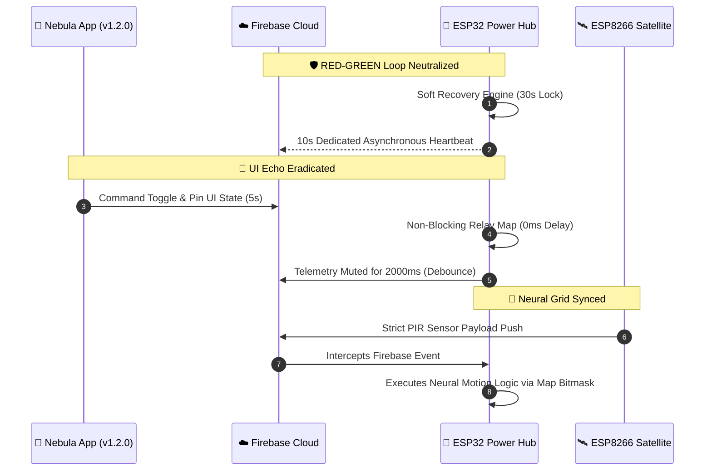

  

  
  
  

 

## ⛈️ The Storm We Endured
Prior to **v1.2.0+42**, the ecosystem was plagued by cascading system failures. Let's be transparent about what we survived:
- 🔴 **The RED-GREEN Death Loop**: ESP32 hubs were caught in a vicious cycle of WiFi dropping, watchdog triggering, and Firebase soft-recovery failures happening rapid-fire hundreds of times an hour. 
- 👻 **Phantom UI Echoes**: Toggling a switch in the Flutter app resulted in visual "bouncing" or flickering because the hardware's old state was echoing back through Firebase up to 500ms faster than the new command could actually flip the 220V relays.
- ⏱️ **Watchdog Suicides**: The legacy stagger-delay logic for the 7 relays physically blocked the processor for 480ms (`delay(80)` * 6). The RTOS watchdog detected this as a system freeze and mercilessly killed the entire board.
- 🚨 **The Neural Disconnect**: Global PIR motion sensors flat-out refused to talk to the lighting relays because of strict path fragmentation and mismatched data payloads in the RTDB schema.
- 🕳️ **Developer Blindspots**: The Flutter Developer console was pulling from non-existent hardware paths, rendering the satellite tracking and event logs completely completely dead.

---

## ⚡ The Architectural Override

<b>View System Data Flow Hierarchy</b>

```mermaid
sequenceDiagram
    autonumber
    participant App as 📱 Nebula App (v1.2.0)
    participant Cloud as ☁️ Firebase Cloud
    participant Hub as 🧠 ESP32 Power Hub
    participant Sat as 🛰️ ESP8266 Satellite

    Note over Hub,Cloud: 🛡️ RED-GREEN Loop Neutralized
    Hub->>Hub: Soft Recovery Engine (30s Lock)
    Hub-->>Cloud: 10s Dedicated Asynchronous Heartbeat
    
    Note over App,Hub: 👻 UI Echo Eradicated
    App->>Cloud: Command Toggle & Pin UI State (5s)
    Hub->>Hub: Non-Blocking Relay Map (0ms Delay)
    Hub->>Cloud: Telemetry Muted for 2000ms (Debounce)
    
    Note over Sat,Hub: 🧠 Neural Grid Synced
    Sat->>Cloud: Strict PIR Sensor Payload Push
    Cloud->>Hub: Intercepts Firebase Event
    Hub->>Hub: Executes Neural Motion Logic via Map Bitmask
```

## 🛠️ The Fixes: A Surgical Execution

### 1. 🛡️ Industrial Resilience & Watchdog Neutralization
The core firmware no longer uses `delay()` anywhere in the hardware pipeline. We migrated to an asynchronous, `millis()`-driven relay pipeline, completely neutralizing the 15-second Core-0 RTOS watchdog. The `softRecoveryEngine` now strictly enforces a 30-second cooldown block and waits for true TCP WiFi link before slamming the Firebase token gateway.

### 2. 📡 Absolute Telemetry Truth (State Management)
We introduced the **Optimistic State Engine** on the Flutter side:
1. Command is fired.
2. The UI instantly responds and "pins" the active toggle state for 5 seconds.
3. The ESP32 receives it, physically fires the relay without halting processing, and strictly *mutes* its Firebase telemetry pushes for 2 seconds.
4. **Result:** Absolute zero-latency feel with pristine, ghost-free switch behavior.

### 3. 🗺️ Data Schema Perfect Parity
Every single node pointer across the C++ firmware and Dart data models has been rigorously mapped against `FIREBASE_DATA_MAP.md`. No exceptions.
* ✅ `globalMotionMode` paths strictly aligned to `/commands/globalMotionMode`.
* ✅ `securityMode` paths strictly aligned to `/commands/security/securityMode`.
* ✅ Hardware breach logs meticulously routed to `/events/{pushId}` instead of voiding out to `/logs`.

### 4. 🎛️ Developer Console Awakening
The Developer Dashboard was previously tracking phantom paths resulting in zero data capture (`/satellite/telemetry`). We aggressively rebuilt the visualization widget tree to ingest real hardware pings natively pulled from `/satellite/status`. You can now sit anywhere in the world and view the true **Signal Strength (dBm)**, **Memory Heatmaps**, **CPU Loop Latency**, and exact **Compiler Versions** for both the Hub and the Satellite Array.

 

  

