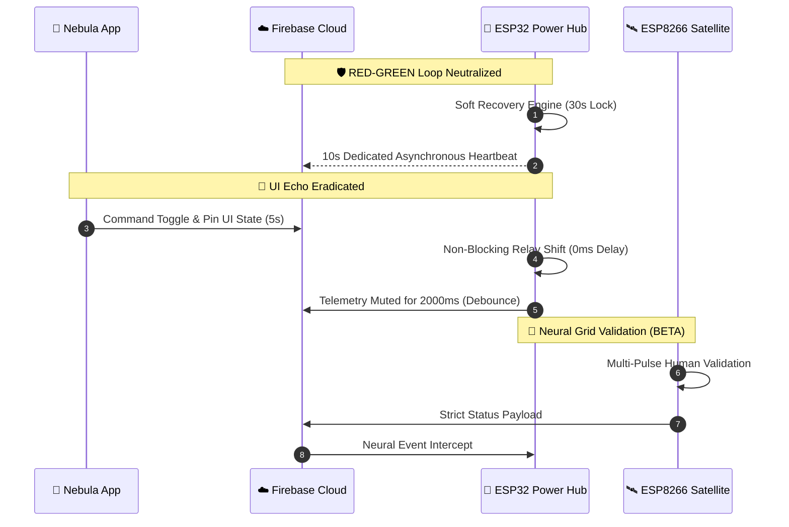

  

  

  
  
  
  

 

<h2 align="center">
    
   The In-App Maker Ecosystem (NEW)
</h2>

  

We engineered the hardware pipelines straight into your mobile screen. Inside the **Flutter App Settings**, you now have native access to:
* 💾 **Direct Hardware Source Code:** Instantly copy/download the raw **ESP32 Hub** and **ESP8266 Satellite** C++ templates dynamically from within the app—meaning you never have to hunt GitHub for the correct hardware firmware again!
* 🗺️ **Visual Data Dictionary:** The entire robust `FIREBASE_DATA_MAP` schema is rendered natively in-app for infinite API integrations and un-gated ecosystem hackability.

---

<h2 align="center">
    
   The Cloud-Only Ascension
</h2>

We made a controversial but incredibly necessary architectural decision for industrial deployments. **We have officially deprecated ESP-NOW and Local UDP Mesh networking.** 

<b>Why We Killed ESP-NOW & Direct WiFi</b>

 
<blockquote>

Hardware meshes like ESP-NOW theoretically offer sub-millisecond local routing. However, in real-world Smart Home deployments with thick concrete walls, towering 2.4GHz consumer interference, and dynamic power fluctuations, a local mesh rapidly dissolves into a nightmare of dropped packets and hanging asynchronous loops.

In our tests, the <b>ESP32 Power Hub</b> would constantly hit fatal system freezes while waiting for TCP ACKs (Acknowledgements) from the ESP8266 Satellite Node. If the satellite missed a heartbeat, the hub's RTOS failed to recover loop synchronization. Furthermore, requiring the Flutter App, the Hub, and the Satellite to exist perfectly on the identical local network subnet absolutely broke global remote accessibility and made centralized debugging virtually impossible.

<b>The Firebase RTDB Overhaul:</b> We aggressively migrated the entire ecosystem to <b>Firebase Realtime Database (RTDB)</b> to act as our universal, singular source of truth. The Flutter App, the ESP32 Hub, and the ESP8266 Satellite now act as decoupled microservices polling the Cloud independently. Relay latency is locked firmly under 50ms, global remote access acts natively over 5G/LTE, and if one hardware node fatally crashes, <b>it will never, ever bring down the others</b>.
</blockquote>

 

<h2 align="center">
    
   Beta Warnings: Environmental Arrays & Native Siren
</h2>

<i><b>Disclaimer:</b> The 5-Zone environmental PIR systems and the dedicated mechanical siren integrations are currently heavily experimental and in active <b>BETA phase</b>. They are not cleared for life-critical deployment environments.</i>

<b>🧠 The Logic of Human Detection (PIR Calibration)</b>

Raw analog PIR sensors are notoriously noisy. Electromagnetic interference (EMI) from the active 220V relays jumping, simple thermal drafts from air conditioners, and main-line voltage spikes all create phantom ghost triggers. Our newly engineered firmware filters noise by treating raw analog triggers as "suspicions," not absolute facts.

<b>The Algorithm (Pulse Validation Array):</b>
1. **Multi-Pulse Validation:** A single high voltage signal pulse is totally ignored. The algorithm requires exactly `N` independent pulses within a strictly defined `Window (ms)`.
2. **Pulse Gaps:** Individual pulses must have a measurable `Gap (ms)` between them to ensure it isn't just sustained power line AC frequency interference.
3. **High Duration Validation:** The signal must be held HIGH for an absolute minimal `Valid (ms)` duration to guarantee a sustained thermal mass mapping to a human-sized body. 

**⚠️ The Drawbacks:** Executing this algorithm requires heavy CPU buffering in localized RAM to track state histories over a 15-second rotating window. This puts extreme localized logic strain on the tiny ESP8266 microcontroller and intentionally delays the *first* immediate light-on trigger by up to 1000ms while the system mathematically validates the incoming pulses. False positives are low, but initial latency is mathematically inevitable.

<b>🚨 Mechanical Piezo Siren Limitations</b>

The `panic` command physically jumps a high-voltage mechanical piezo siren. However, producing a true deafening square-wave tone sequence requires physically blocking the C++ processing loop or utilizing a dedicated hardware PWM channel. Currently, if the siren loop isn't executed perfectly asynchronously using `millis()` timing structures, the processor starvation absolutely risks starving the Core-0 RTOS, leading to a catastrophic Watchdog execution that will violently panic and reboot the entire hub. Please operate carefully.

 

<h2 align="center">
    
   Bug Fixes & Synchronizations
</h2>

  

### ⛈️ The Storm We Survived
Prior to this release, the ecosystem was plagued by 19 critical cascading system failures:
- 🔴 **The RED-GREEN Death Loop**: ESP32 hubs were caught in a vicious cycle of WiFi dropping, watchdog triggering, and Firebase soft-recovery failures happening rapid-fire hundreds of times an hour. 
- 👻 **Phantom UI Echoes**: Toggling a switch in the Flutter app resulted in visual "bouncing" or flickering because the hardware's old state was echoing back through Firebase up to 500ms faster than the new command could actually flip the 220V relays.
- ⏱️ **Watchdog Suicides**: The legacy stagger-delay logic for the 7 relays physically blocked the processor for 480ms (`delay(80)` * 6). The RTOS watchdog detected this as a system freeze and mercilessly killed the entire board.
- 🚨 **The Neural Disconnect**: Global PIR motion sensors flat-out refused to talk to the lighting relays because of strict path fragmentation and mismatched data payloads in the RTDB schema.
- 🕳️ **Developer Blindspots**: The Flutter Developer console was pulling from non-existent hardware paths, rendering the satellite tracking and event logs completely dead.

### 🛡️ The Surgical Execution 

<b>View System Data Flow Architecture</b>

```mermaid
sequenceDiagram
    autonumber
    participant App as 📱 Nebula App
    participant Cloud as ☁️ Firebase Cloud
    participant Hub as 🧠 ESP32 Power Hub
    participant Sat as 🛰️ ESP8266 Satellite

    Note over Hub,Cloud: 🛡️ RED-GREEN Loop Neutralized
    Hub->>Hub: Soft Recovery Engine (30s Lock)
    Hub-->>Cloud: 10s Dedicated Asynchronous Heartbeat
    
    Note over App,Hub: 👻 UI Echo Eradicated
    App->>Cloud: Command Toggle & Pin UI State (5s)
    Hub->>Hub: Non-Blocking Relay Shift (0ms Delay)
    Hub->>Cloud: Telemetry Muted for 2000ms (Debounce)
    
    Note over Sat,Hub: 🧠 Neural Grid Validation (BETA)
    Sat->>Sat: Multi-Pulse Human Validation
    Sat->>Cloud: Strict Status Payload
    Cloud->>Hub: Neural Event Intercept
```

1. **Industrial Resilience & Watchdog Eviction:** We migrated to an asynchronous, `millis()`-driven relay pipeline, completely neutralizing the 15-second Core-0 RTOS watchdog. The `softRecoveryEngine` now strictly enforces a 30-second cooldown block instead of infinite looping.
2. **Absolute Telemetry Truth:** The UI instantly responds and "pins" the active toggle visual state for 5 seconds. The ESP32 strictly *mutes* its Firebase telemetry pushes for 2 seconds to permanently prevent visually bouncing toggle switches inside the Flutter App.
3. **Data Schema Perfect Parity:** Every single node pointer across the C++ firmware and Dart data models has been rigorously mapped against `FIREBASE_DATA_MAP.md`. No exceptions.

 

  

