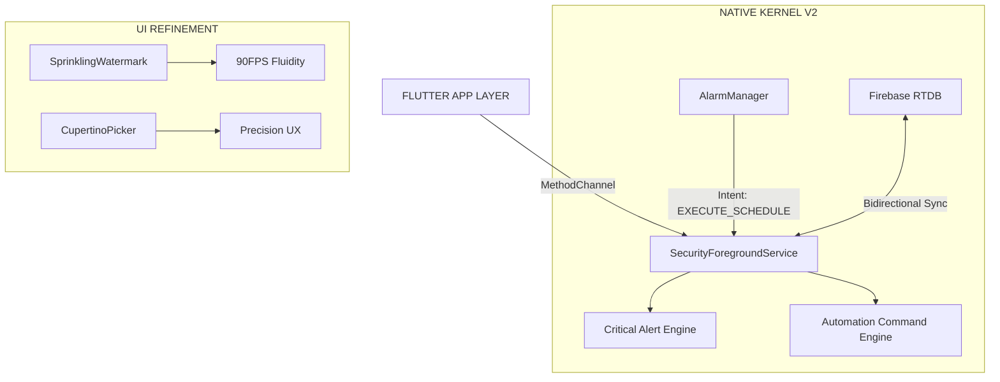

# Nebula Core v1.2.0+34.5 (UNIFIED RELIABILITY)

**Release Date:** April 5, 2026  
**Build ID:** `NC-ANDROID-REL-35`  
**Update Size:** ARCHITECTURAL UNIFICATION & UI REFINEMENT  
**Priority:** MANDATORY (Stability & Performance)

---

## 🚀 WHAT'S NEW: UNIFIED ENGINE & SPRINKLING UI

This release focuses on "Industrial Grade" background reliability by unifying the Scheduler and Security engines into a single, high-performance foreground process.

### 🛡️ Unified Background Engine (Titanium v2)
*   **Persistent Service**: Scheduler now resides within the `SecurityForegroundService` for 24/7 uptime.
*   **Zero-Drop reliability**: Guarantees alarm triggering even when the app is force-closed or the device is in deep sleep.
*   **Android 14 Optimized**: Fully compatible with the latest background execution protocols.
*   **WakeLock Guard**: Efficient 8-second execution window to protect battery health.

### ✨ Sprinkling Watermark (Premium UI)
*   **Theme Blending**: Animated particle effect that adapts to your theme colors.
*   **Non-Blocking Logic**: Pure `flutter_animate` implementation for buttery-smooth scrolling.
*   **Clean Branding**: Modern "Kiran Embedded" footer with horizontal rule-sets.

### 🕒 Premium Cupertino Scheduler
*   **Smooth Selection**: Native iOS-style time picker for precise automation.
*   **Neon Beads**: Interactive "bead" animation for a state-of-the-art feel.
*   **Haptic Tactility**: Crisp selection feedback on every interaction.

### ☁️ Intelligent Firebase Sync
*   **Debouncing (2s)**: Prevents "Command Storms" by filtering rapid telemetry noise.
*   **Local History Resolution**: Instantly resolves relay nicknames without extra database hits.

---

## 🏗️ SYSTEM ARCHITECTURE (UNIFIED)

---

## 📋 TECHNICAL CHANGELOG

*   `[CORE]` **Versioning**: Incremented Build ID to `35` (Internal v1.2.0+34.5).
*   `[ARCH]` **Service Unification**: Merged `NativeAlarmService` into `SecurityForegroundService`.
*   `[UI]` **Watermark**: Replaced hardcoded footer with `SprinklingWatermark` animated widget.
*   `[UI]` **Scheduler**: Integrated `CupertinoPicker` and removed performance-heavy glass blurs.
*   `[FIX]` **Stability**: Resolved all recent MethodChannel and Kotlin syntax regressions.
*   `[PERF]` **Debounce**: Implemented 2s cloud sync throttle to optimize database usage.

---

**DEPLOYMENT STATUS: RELEASE READY**  
*Nebula Core - Precise. Beautiful. Efficient.*
