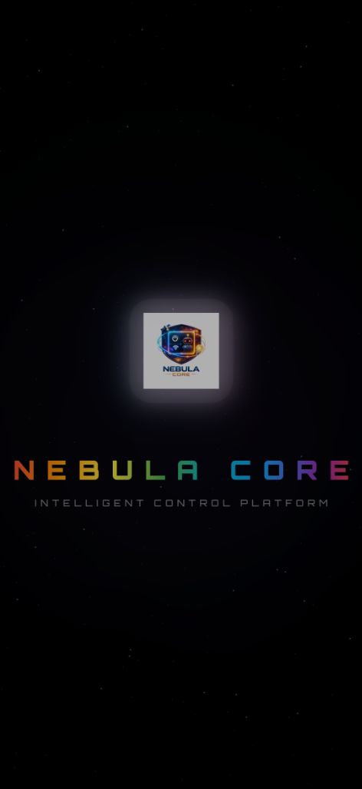
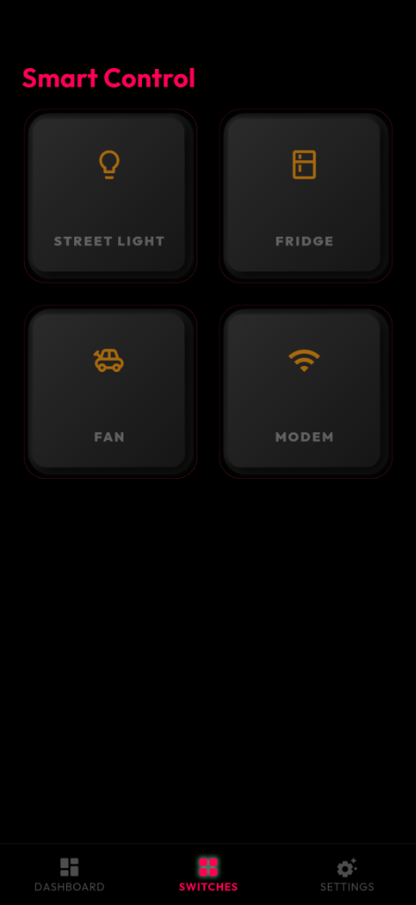
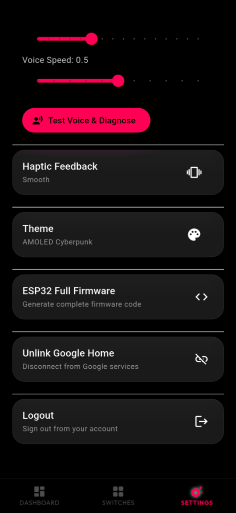

# 🌌 Nebula Core

<div align="center">

**Production-Ready ESP32 Smart Switch Control System**

[](https://flutter.dev)
[](https://firebase.google.com)
[](https://www.espressif.com)
[](LICENSE)

*A stunning Flutter application for controlling ESP32-based smart power grids with real-time Firebase synchronization, dynamic configuration, and AI-powered voice control.*

</div>

---

## ✨ Features

### 🎯 Core Functionality
- **🔌 Smart Relay Control** - Control up to 4 relays per ESP32 device with instant response
- **🔥 Firebase Realtime Database** - 100% Firebase-based command/telemetry architecture
- **⚡ Real-time Synchronization** - Bidirectional state updates with optimistic UI
- **🎨 Premium UI/UX** - Glassmorphic design with neon animations and smooth 60fps transitions
- **🤖 AI Voice Assistant** - Text-to-speech and speech recognition for hands-free control
- **📊 Live Telemetry** - Real-time voltage, current, and power monitoring
- **🌡️ Weather Integration** - Location-based weather data display
- **🔐 Google Sign-In** - Secure authentication with dynamic OAuth configuration

### 🛠️ Advanced Features
- **🔧 Zero Hardcoding** - Fully dynamic Firebase configuration at runtime
- **🏭 Production Ready** - Users configure their own Firebase projects via UI
- **📱 Multi-Device Support** - Manage unlimited ESP32 devices with unique IDs
- **✏️ Custom Switch Naming** - Dual naming system (local nicknames + Firebase hardware names)
- **🎯 Dynamic Icon System** - Context-aware icons based on switch names (lights, fans, etc.)
- **🔄 Connection Resilience** - Auto-reconnect with timeout handling and Firebase reset
- **🐛 Debug Tools** - Built-in diagnostics for Firebase sync and telemetry inspection
- **💾 Persistent Storage** - Local caching of switch nicknames and settings

---

## 🚀 Quick Start

### Prerequisites
- **Flutter SDK** `>=3.10.4`
- **Android Studio** or **VS Code** with Flutter extensions
- **Firebase Account** (free tier supported)
- **ESP32 Development Board** (for hardware testing)

### Installation

1. **Clone the repository**
   ```bash
   git clone https://github.com/yourusername/nebula_core.git
   cd nebula_core
   ```

2. **Install dependencies**
   ```bash
   flutter pub get
   ```

3. **Run the app**
   ```bash
   flutter run
   ```

4. **Build release APK**
   ```bash
   flutter build apk --release
   # APK location: build/app/outputs/flutter-apk/app-release.apk
   ```

---

## 🔧 Firebase Configuration

### Why Firebase?

Nebula Core uses **Firebase Realtime Database** as the exclusive communication layer between the Flutter app and ESP32 devices. This provides:

- ✅ **Real-time bidirectional sync** - Changes propagate instantly
- ✅ **Offline persistence** - Works without constant internet
- ✅ **Scalability** - Handle unlimited devices on free tier
- ✅ **Security** - Built-in authentication and database rules
- ✅ **No server required** - Serverless architecture

### Setup Steps

Nebula Core supports **100% dynamic Firebase configuration** - zero hardcoded credentials!

#### 1. Create Firebase Project

1. Go to [Firebase Console](https://console.firebase.google.com)
2. Click **Add Project** and follow the wizard
3. Enable **Google Analytics** (optional)

#### 2. Enable Realtime Database

1. In Firebase Console, navigate to **Build → Realtime Database**
2. Click **Create Database**
3. Choose **Start in test mode** (for development)
4. Note your **Database URL** (e.g., `https://your-project.firebaseio.com`)

#### 3. Enable Authentication

1. Navigate to **Build → Authentication**
2. Click **Get Started**
3. Enable **Google Sign-In** provider
4. Add your **SHA-1** and **SHA-256** fingerprints (see below)

#### 4. Get Firebase Credentials

1. Go to **Project Settings** (gear icon)
2. Under **Your apps**, add an **Android app**
3. Download `google-services.json` (optional - app uses dynamic config)
4. Copy these values for app configuration:
   - **API Key** (from `google-services.json` or Project Settings)
   - **Project ID** (from Project Settings)
   - **Database URL** (from Realtime Database)
   - **App ID** (from `google-services.json`)
   - **Messaging Sender ID** (from Project Settings)
   - **Web Client ID** (from Authentication → Google Sign-In)

#### 5. Configure in App

1. Launch Nebula Core
2. Navigate to **Settings → Production Setup**
3. Enter all Firebase credentials from step 4
4. Tap **Save Configuration**
5. Restart the app

📖 **Detailed Guide**: See [FIREBASE_PRODUCTION_GUIDE.md](FIREBASE_PRODUCTION_GUIDE.md)

### Getting SHA-1/SHA-256 Fingerprints

For Google Sign-In to work, add your app's fingerprints to Firebase:

```bash
# Debug keystore (for development)
keytool -list -v -keystore ~/.android/debug.keystore -alias androiddebugkey -storepass android -keypass android

# Release keystore (for production)
keytool -list -v -keystore /path/to/your-release-key.jks -alias your-key-alias
```

Copy the **SHA-1** and **SHA-256** values and add them in Firebase Console → Project Settings → Your apps → SHA certificate fingerprints.

---

## 🎛️ ESP32 Firmware

### Firebase Architecture

The ESP32 firmware communicates exclusively via Firebase Realtime Database:

```
/devices/{deviceId}/
├── commands/          # App writes commands here
│   ├── relay1: 0|1   # 0=OFF, 1=ON
│   ├── relay2: 0|1
│   ├── relay3: 0|1
│   └── relay4: 0|1
├── telemetry/         # ESP32 writes state here
│   ├── relay1: 0|1   # Current state
│   ├── relay2: 0|1
│   ├── relay3: 0|1
│   ├── relay4: 0|1
│   ├── voltage_ac: 230.5
│   ├── current: 2.3
│   └── lastSeen: 1640000000000
└── relayNames/        # Hardware names (synced)
    ├── relay1: "Living Room Light"
    ├── relay2: "Bedroom Fan"
    ├── relay3: "Kitchen Outlet"
    └── relay4: "Garage Door"
```

### Universal Firmware Features

The included firmware (`firmware/esp32_nebula_controller.ino`) provides:

- ✅ **Automatic Device ID** - Generated from ESP32 Chip ID
- ✅ **Firebase Command Listener** - Monitors `/commands/` path
- ✅ **Telemetry Publisher** - Updates `/telemetry/` every second
- ✅ **Real-time Voltage & Current** - ACS712 sensor support
- ✅ **4-Channel Relay Control** - GPIO-based switching
- ✅ **State Persistence** - Survives power cycles
- ✅ **OTA Updates Ready** - Firmware updates over WiFi

### Flashing Instructions

1. **Install Arduino IDE** and ESP32 board support
2. **Install Libraries**:
   - `Firebase ESP32 Client` by Mobizt
   - `WiFi` (built-in)
3. **Open Firmware**:
   ```bash
   # Open firmware/esp32_nebula_controller.ino in Arduino IDE
   ```
4. **Configure WiFi & Firebase**:
   ```cpp
   // WiFi credentials
   const char* ssid = "YOUR_WIFI_SSID";
   const char* password = "YOUR_WIFI_PASSWORD";
   
   // Firebase credentials
   #define FIREBASE_HOST "your-project.firebaseio.com"
   #define FIREBASE_AUTH "your-database-secret"
   ```
5. **Select Board**: Tools → Board → ESP32 Dev Module
6. **Upload**: Click Upload button

📖 **Hardware Guide**: See [SETUP_GUIDE.md](SETUP_GUIDE.md)

---

## 📱 App Architecture

### Technology Stack

- **Framework**: Flutter 3.10.4+
- **State Management**: Riverpod (Provider-based)
- **Backend**: Firebase Realtime Database
- **Authentication**: Firebase Auth + Google Sign-In
- **Local Storage**: SharedPreferences
- **UI**: Custom glassmorphic widgets with animations

### Project Structure

```
lib/
├── main.dart                           # App entry point with dynamic Firebase init
├── core/
│   └── constants/
│       └── app_constants.dart          # Default device ID and constants
├── models/
│   └── switch_device.dart              # Switch data model
├── providers/
│   └── switch_provider.dart            # Relay state management (Riverpod)
├── services/
│   ├── firebase_switch_service.dart    # Firebase command/telemetry logic
│   ├── firebase_config_service.dart    # Dynamic Firebase configuration
│   ├── persistence_service.dart        # Local nickname storage
│   └── device_icon_resolver.dart       # Context-aware icon mapping
├── screens/
│   ├── home_screen.dart                # Main dashboard
│   ├── settings_screen.dart            # Configuration UI
│   ├── firebase_setup_screen.dart      # Firebase credentials input
│   └── login_screen.dart               # Google Sign-In
└── widgets/
    ├── switch_grid/
    │   └── switch_tile.dart            # Animated relay tile
    ├── robo/                           # AI assistant UI
    └── live_info/
        └── status_card.dart            # Telemetry display cards
```

### Key Design Patterns

#### 1. Optimistic UI Updates
When a user toggles a switch, the UI updates **instantly** before Firebase confirmation:

```dart
// 1. Update UI immediately
state = [for (final d in state) 
  if (d.id == id) d.copyWith(isActive: newState, isPending: true) else d];

// 2. Send command to Firebase
await firebaseService.sendCommand(id, newState ? 0 : 1);

// 3. Wait for telemetry confirmation (handled by listener)
```

#### 2. Jitter Protection
Prevents UI flickering from stale telemetry during rapid toggles:

```dart
// Ignore conflicting telemetry for 2 seconds after user action
if (_pendingSwitches.containsKey(device.id)) {
  if (DateTime.now().difference(pendingTime).inMilliseconds < 2000) {
    newIsActive = device.isActive; // Keep local state
  }
}
```

#### 3. Dual Naming System
- **Nickname** (local): Stored in SharedPreferences, never synced
- **Hardware Name** (Firebase): Synced to `/relayNames/`, visible to ESP32

---

## 🎨 UI Showcase

<p float="left" align="center">
  
   
  
  
</p>
<p float="left" align="center">
  
  
  
</p>

### Design Philosophy
- **Glassmorphism** - Frosted glass effects with backdrop blur
- **Neon Aesthetics** - Dynamic HSL-based color gradients (unique per switch)
- **Smooth Animations** - 60fps micro-interactions with `flutter_animate`
- **Dark Mode First** - Optimized for OLED displays with deep blacks

### Key Screens

#### 🏠 Home Dashboard
- **Live Switch Grid** - 4 animated relay tiles with unique neon colors
- **System Status Card** - Real-time voltage, current, power, and connection status
- **Weather Card** - Location-based temperature and conditions
- **Robo Assistant Button** - Quick access to voice control

#### ⚙️ Settings
- **Production Setup** - Firebase credentials configuration
- **Device Management** - Switch naming and icon customization
- **Debug Tools** - Force hardware sync, Firebase path inspector

#### 🤖 Robo Assistant
- **Voice Control** - "Turn on living room light"
- **Text-to-Speech** - Audible confirmations
- **Glassmorphic UI** - Animated waveform during speech

---

## 🧪 Testing & Debugging

### Built-in Debug Features

1. **Force Hardware Sync**
   - Manually fetch relay names from Firebase
   - Displays raw data and sync status
   - Accessible via Settings → Debug Tools

2. **Firebase Path Inspector**
   - View raw JSON snapshots from database
   - Verify command/telemetry structure
   - Check `lastSeen` timestamps

3. **Connection Status**
   - Real-time Firebase connection indicator
   - Auto-reconnect on timeout
   - Offline mode detection

### ADB Logcat Integration

Monitor real-time logs during development:

```bash
# Filter for app logs
adb logcat | grep -i "flutter\|firebase\|nebula"

# Clear and monitor
adb logcat -c && adb logcat *:E flutter:V
```

### Running Tests

```bash
# Unit tests
flutter test

# Integration tests
flutter test integration_test/
```

---

## 📦 Dependencies

### Core
- `flutter_riverpod: ^2.6.1` - Reactive state management
- `firebase_core: ^3.6.0` - Firebase initialization
- `firebase_database: ^11.1.0` - Realtime Database client
- `firebase_auth: ^5.3.1` - Authentication
- `google_sign_in: ^6.2.1` - OAuth integration

### UI/UX
- `flutter_animate: ^4.5.0` - Smooth animations
- `glassmorphism: ^3.0.0` - Frosted glass effects
- `shimmer: ^3.0.0` - Loading states
- `google_fonts: ^6.1.0` - Typography (Poppins, Orbitron)
- `font_awesome_flutter: ^10.7.0` - Icon library

### Utilities
- `shared_preferences: ^2.3.2` - Local storage
- `geolocator: ^12.0.0` - Location services
- `flutter_tts: ^4.0.2` - Text-to-speech
- `speech_to_text: ^7.0.0` - Voice recognition
- `http: ^1.2.2` - Weather API calls

📄 **Full list**: See [pubspec.yaml](pubspec.yaml)

---

## 🛣️ Roadmap

### Planned Features
- [ ] **Multi-language Support** (i18n with `flutter_localizations`)
- [ ] **Scheduling & Automation** (timer-based relay control)
- [ ] **Energy Analytics** (historical power consumption graphs)
- [ ] **Scene Management** (one-tap multi-device control)
- [ ] **iOS Support** (currently Android-focused)
- [ ] **Web Dashboard** (browser-based control panel)
- [ ] **Push Notifications** (Firebase Cloud Messaging)
- [ ] **Backup/Restore** (export/import configurations)

### Known Limitations
- **Android Only** - iOS support requires additional Firebase setup
- **Single Device ID** - Currently defaults to `79215788` (configurable in code)
- **No User Management** - All users share same Firebase database (add security rules for production)

---

## 🤝 Contributing

Contributions are welcome! Here's how to get started:

### Development Setup

1. **Fork the repository**
2. **Clone your fork**:
   ```bash
   git clone https://github.com/YOUR_USERNAME/nebula_core.git
   cd nebula_core
   ```
3. **Create a feature branch**:
   ```bash
   git checkout -b feature/amazing-feature
   ```
4. **Make your changes** and test thoroughly
5. **Commit with clear messages**:
   ```bash
   git commit -m "Add amazing feature: description"
   ```
6. **Push to your fork**:
   ```bash
   git push origin feature/amazing-feature
   ```
7. **Open a Pull Request** with detailed description

### Code Style
- Follow [Effective Dart](https://dart.dev/guides/language/effective-dart) guidelines
- Use `flutter analyze` to check for issues
- Format code with `dart format .`
- Add comments for complex logic

---

## 📄 License

This project is licensed under the **MIT License**:

```
MIT License

Copyright (c) 2025 Nebula Core Contributors

Permission is hereby granted, free of charge, to any person obtaining a copy
of this software and associated documentation files (the "Software"), to deal
in the Software without restriction, including without limitation the rights
to use, copy, modify, merge, publish, distribute, sublicense, and/or sell
copies of the Software, and to permit persons to whom the Software is
furnished to do so, subject to the following conditions:

The above copyright notice and this permission notice shall be included in all
copies or substantial portions of the Software.

THE SOFTWARE IS PROVIDED "AS IS", WITHOUT WARRANTY OF ANY KIND, EXPRESS OR
IMPLIED, INCLUDING BUT NOT LIMITED TO THE WARRANTIES OF MERCHANTABILITY,
FITNESS FOR A PARTICULAR PURPOSE AND NONINFRINGEMENT. IN NO EVENT SHALL THE
AUTHORS OR COPYRIGHT HOLDERS BE LIABLE FOR ANY CLAIM, DAMAGES OR OTHER
LIABILITY, WHETHER IN AN ACTION OF CONTRACT, TORT OR OTHERWISE, ARISING FROM,
OUT OF OR IN CONNECTION WITH THE SOFTWARE OR THE USE OR OTHER DEALINGS IN THE
SOFTWARE.
```

See [LICENSE](LICENSE) file for full details.

---

## 🙏 Acknowledgments

- **Flutter Team** - For the incredible cross-platform framework
- **Firebase** - For serverless real-time database infrastructure
- **ESP32 Community** - For open-source hardware libraries and support
- **Riverpod** - For elegant state management patterns
- **Mobizt** - For the excellent `Firebase ESP32 Client` library

---

## 📞 Support

### Get Help
- **📖 Documentation**: See guides in `/docs` folder
- **🐛 Bug Reports**: [GitHub Issues](https://github.com/yourusername/nebula_core/issues)
- **💬 Discussions**: [GitHub Discussions](https://github.com/yourusername/nebula_core/discussions)
- **📧 Email**: kiran.cybergrid@gmail.com

### Troubleshooting

**App won't connect to Firebase?**
- Verify Database URL format: `https://your-project.firebaseio.com`
- Check Firebase Realtime Database rules (should allow read/write for testing)
- Ensure device has internet connection

**Google Sign-In fails?**
- Add SHA-1/SHA-256 fingerprints to Firebase Console
- Verify Web Client ID is correct
- Check `google-services.json` package name matches app

**ESP32 not responding?**
- Verify WiFi credentials in firmware
- Check Firebase credentials match app configuration
- Monitor Serial output for connection errors

📖 **Full troubleshooting**: See [TROUBLESHOOTING.md](TROUBLESHOOTING.md)

---

<div align="center">

### 🌟 Built with ❤️ using Flutter & Firebase

**⭐ Star this repo if you find it useful!**

**🔗 Share with the maker community**

---


</div>
