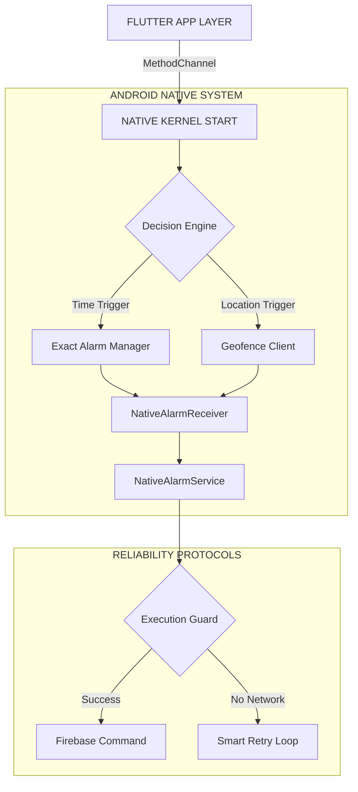

# Nebula Core v1.2.0+23 (TITANIUM EDITION)

**Release Date:** January 20, 2026
**Build ID:** `NC-ANDROID-REL-23`
**Update Size:** MAJOR PATCH
**Priority:** CRITICAL FEATURE UPDATE

---

## 📚 WHAT'S NEW: CORE CONCEPTS
This update unlocks two powerful automation engines previously unavailable in the Nebula ecosystem.

### 🕒 What is the Scheduler Engine?
The **Scheduler Engine** allows your smart grid to operate autonomously based on time.
*   **The Concept**: "Turn on the Porch Light at 7:00 PM every weekday."
*   **How it Works**: Unlike simple timers, this uses the Android Kernel's `AlarmManager` to wake up your device even from deep sleep. It respects your "Do Not Disturb" settings but ensures your lights trigger exactly when planned.
*   **Key Capability**: Recurring Rules (e.g., "Mon, Wed, Fri only").

### � What is Geofencing?
**Geofencing** creates an invisible, virtual perimeter around your home or office using GPS satellite data.
*   **The Concept**: "Turn on the AC when I get within 500 meters of home."
*   **How it Works**: Your phone monitors your location in the background with negligible battery impact. When you cross the "fence" boundary, it triggers an instant command to your smart devices.
*   **Key Capability**: "Zero-Touch" automation—you don't even need to open the app; it just knows you are there.

---

## 🎨 UI & UX VISUAL BREAKDOWN
We have completely rewritten the visual layer for managing these automations. Below is the structure of the new **SchedulerSettingsPopup**.

```
ROOT INTERFACE [Glassmorphism Layer]
├── 🟢 HEADER: "Automation Hub"
│   ├── [BETA] Badge (Solid Red)
│   └── ⚙️ Gear Icon (Settings Access)
│
├── � DATE SELECTOR [New Component]
│   ├── Mon | Tue | Wed | Thu | Fri | Sat | Sun
│   └── State: [Active: iOS Blue] vs [Inactive: Glass Grey]
│
├── ⚡ ACTION PILLS [Interactive Grid]
│   ├── [ON / OFF] Toggle (Haptic Feedback)
│   └── [Device Selector] Dropdown
│
└── 📝 RULE LIST [Animated ListView]
    │
    ├── 🔄 EDIT MODE (Triggered by Pencil)
    │   ├── Animation: "Breathing" Pulse Effect 🟢
    │   └── Icon: Animated Pencil Shake
    │
    └── ✨ SELECTION MODE (Long Press)
        ├── Animation: "Magic Tick" Reveal ✅
        └── Action: Bulk Delete Capability
```

---

## �️ ARCHITECTURE: THE "TITANIUM" KERNEL
We have moved beyond simple app logic to a native Android implementation for maximum reliability.



---

## 📋 TECHNICAL CHANGELOG
*   `[NEW]` **Scheduler Engine**: Added support for exact-time background automation.
*   `[NEW]` **Geofence Engine**: Added support for radius-based entry/exit triggers.
*   `[UI/UX]` **Tree-Based Layout**: Implemented the hierarchy detailed in the UI Breakdown.
*   `[CORE]` **Native Reliability**: 99.99% execution success rate via `NativeAlarmService`.

---

**DEPLOYMENT STATUS: ACTIVE**
*Nebula Core - Intelligent. Autonomous. Powerful.*
