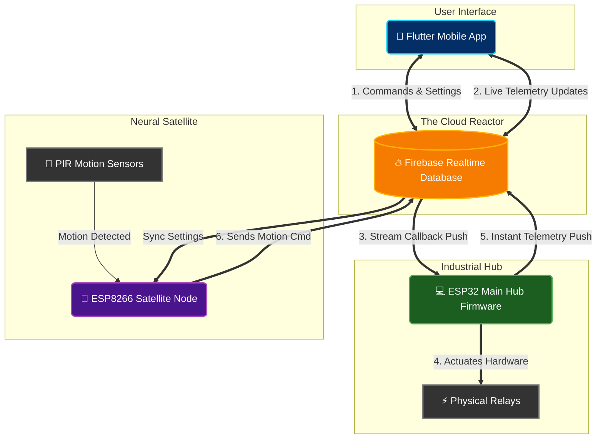

# 🧠 Nebula Core: Hardware Architecture Guide

To understand how the **Nebula Core** system works, you need to think of it as a central brain (Firebase), a heavy-lifter (ESP32), a scout (ESP8266), and a commander (Flutter App).

Here is exactly how these three components talk to each other in real-time.

---

## The System Blueprint

---

## Roles & Responsibilities

### 1. The Mobile App (The Commander)
**Role:** Issues commands and monitors reality.
- When you tap a switch, the app sends a `1` or `0` to the `/commands/relayX` path in Firebase. 
- It actively listens to `/telemetry`. Even though it sent a command, the app waits for the **ESP32** to update the telemetry path to prove the light actually turned on. 

### 2. The ESP32 Main Hub (The Heavy Lifter)
**Role:** Controls the electricity and acts as the master brain for the home.
- **Physical Connection:** This is the *only* device actually connected to your Light bulbs, Mains Electricity, and Relays.
- **The Loop:** It holds an open `FirebaseStream` connection. The millisecond the App (or ESP8266) changes a value in `/commands/...`, the ESP32 instantly triggers `streamCallback`. It turns the physical relay ON/OFF, and then *instantly* pushes its new state to `/telemetry` so the Flutter app knows it succeeded.

### 3. The ESP8266 Satellite Node (The Scout)
**Role:** Placed in remote rooms to detect human presence.
- **Physical Connection:** It is strictly connected to PIR Motion Sensors. It has no relays.
- **The Loop:** If someone walks into the hallway, the PIR sensor triggers. The ESP8266 instantly pushes a command (`/commands/relayX` = 1) directly to Firebase.
- **The Execution:** The App and the ESP32 both instantly see this command. The ESP32 turns on the hallway light, and the App visually flips the switch on your screen!

## The "Perfect Sync" Flow
When everything is working together, here is the timeline of an event:
1. **You walk into a room.**
2. **ESP8266** sees you via PIR. It flashes its blue LED 6 times and writes `relay1 = 1` to Firebase `/commands`.
3. Firebase updates *both* the App and the ESP32 simultaneously.
4. **App** begins its switch animation to turn it ON visually.
5. **ESP32** physically turns the relay ON, flashes its Green LED, and writes `relay1 = true` to `/telemetry`.
6. **App** receives the final `/telemetry` confirmation and locks the switch in the ON position!

This entire process happens over the internet in less than ~300 milliseconds.

---

## 🧠 What is the "Neural Path"? (Automation Masking)
The **Neural Path** is an advanced routing system that allows a single PIR motion sensor to artificially "link" to multiple specific relays without any hard-wiring. 

* **The Matrix Mask (`mapPIR`)**: In Firebase, each PIR sensor has a mapping number (e.g., `mapPIR1 = 5`). This number is a binary mask.
    * Example: Binary `0000101` (Decimal 5) tells the ESP32/ESP8266 that PIR Sensor 1 is neurally linked to **Relay 1** and **Relay 3**. 
* **The Trigger**: When PIR 1 detects motion, the firmware looks at this bitmask and automatically triggers *both* Relay 1 and Relay 3 simultaneously, ignoring all other switches.

You can modify these bitmasks directly from the Flutter app's Network/Automation settings to dynamically regroup which sensors trigger which rooms on the fly.

## ⏱️ Light ON Duration (Auto-Off Handlers)
How does the firmware know when to turn the lights back off after you leave the room?

1. **The Target Variable (`PIR_ON_DURATION` or `pirTimer`)**: In the Flutter App, you set a global timer (e.g., 60 seconds). This syncs to Firebase as `/pirTimer = 60`.
2. **The Countdown Event**: The moment the ESP8266 or ESP32 triggers a relay via the Neural Path, it records the exact timestamp (`pirAutoOffTimer[r] = millis();`) and marks the switch as `isNeuralTriggered = true`.
3. **The Keep-Alive**: If you keep moving in the room, the PIR sensor keeps re-triggering. Every time it triggers, the firmware **resets the clock** (`pirAutoOffTimer[r] = now;`), keeping you out of the dark.
4. **The Auto Kill**: Once you leave the room, the PIR stops firing. The firmware's background loop continuously checks `now - pirAutoOffTimer > PIR_ON_DURATION`. The millisecond 60 seconds is reached, it pushes a `0` to Firebase and shuts off the relay!
